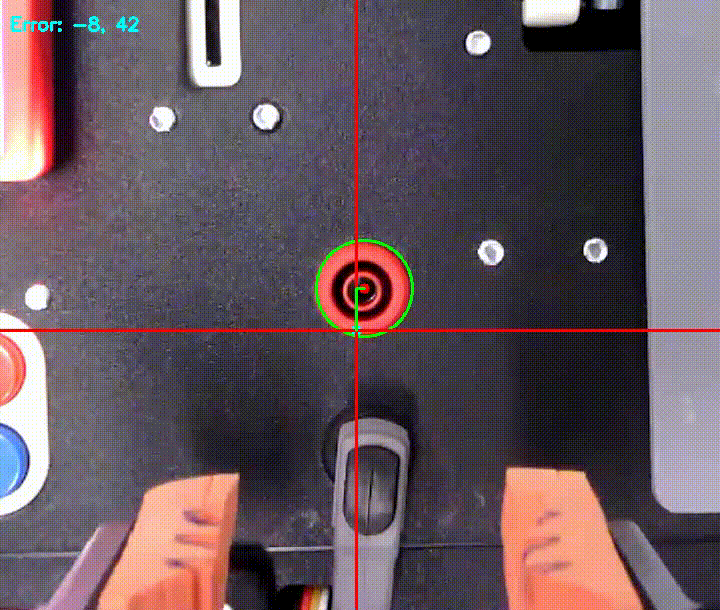
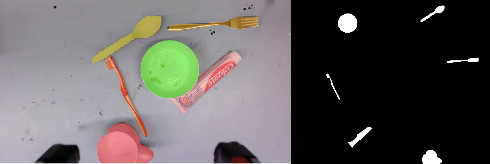

# Kinova Apps
This repository contains the applications and documentation developed for the Kinova Gen3 Arm. 

# Platform
We use the 7-dof Kinova Gen3 with a Robotiq 2F-85 gripper. The arm comes with a wrist-mounted RealSense depth module, which provides an RGB and depth stream. Additionally, the joint torques are used to estimate the force and torque at the end-effector. We use an Intel NUC with an Intel Core i7 processor as the main computer.

* [7-dof Kinova Gen3 Arm with Intel RealSense Depth Module 410](https://www.kinovarobotics.com/product/gen3-robots)
* [Robotiq 2F-85 adaptive gripper](https://robotiq.com/products/2f85-140-adaptive-robot-gripper) with foam and zip tie attached to the fingers (see image below)
* [Intel NUC](https://www.intel.com/content/www/us/en/products/sku/190109/intel-nuc-9-extreme-kit-nuc9i7qnx/specifications.html) with an Intel Core i7 processor, and 8 GB of RAM


# Quick Start Guide
## Dependencies
We use Ubuntu 20.04 / Pop! OS 20.04 as the operating system, with ROS Noetic for interprocess communication.
### ROS dependencies
- [kortex](https://github.com/Kinovarobotics/kortex)
- [ros_kortex](https://github.com/Kinovarobotics/ros_kortex)
- [ros_kortex_vision](https://github.com/Kinovarobotics/ros_kortex_vision)
- [cv_bridge](http://wiki.ros.org/cv_bridge)
- ros-noetic-pcl-ros
- ros-noetic-perception-pcl

### Additional Python dependencies
Apart from standard Python packages and the ROS Python packages, the following packages are needed (can be installed via `pip3 install`:
- opencv-python
- scipy
- PyQt5
- yolov5
- Tkinter
- Pyperclip
- pytesseract

## Setup the robot

1. Connect an ethernet cable from the robot to the computer
2. Open Settings -> Network -> Wired (click on setting icon) -> Go to IPv4 -> Click on "Manual" IPv4 Method -> Under Addresses, in Address, type `192.168.1.110` | in Netmask, type `255.255.255.0` -> Apply
3. On the browser (Chrome), type URL `192.168.1.12` (assuming the address of the robot is configured to 192.168.1.12)
4. Username: admin, Password: <type-password-here>

## Update launch file

1. roscd kortex_driver/launch
2. Open kortex_driver.launch
3. Change the IP address to `192.168.1.12`
4. Change password to the password you set
5. Add default gripper, it should look like this (line 13) `<arg name="gripper" default="robotiq_2f_85" if="$(eval arg('arm') == 'gen3')"/>`
6. Change the IP address to `192.168.1.12` (line 3) in `kinova_vision_rgbd.launch` file

## Launch

- Launch the necessary nodes to bringup the arm and the camera.

- Run each of the following in separate terminals:

  ```
  roscore
  roslaunch kortex_driver kortex_driver.launch
  roslaunch kinova_vision kinova_vision_rgbd.launch
  ```

  Visualize debug images and TF tree in RViz using [config/kinova.rviz](config/robothon.rviz)

  
## Apps

### Clutter Pick and Place

- Launch the clutter pick and place app

  ```
  roslaunch kinova_apps clear_clutter_action.launch gui:=false object_type:=1
  ```

  - `object_type`: 0 - cubes, 1 - real objects
  - real objects list: cup, bowl, fork, spoon, toothbrush, toothpase
  - `gui`: true - show gui, false - no gui
- Once launched, the app will go to a perceive pose and detect cubes/objects on the table. The detection results are published to the rviz. The arm will then pick the objects and drops it on the left side.

> Other apps are not refractored yet.

## Software
We mainly use Python for development (with one component in C++), and ROS Noetic for interprocess communication, including communication with the [kortex_driver](https://github.com/Kinovarobotics/ros_kortex). For vision, we use the [kinova_vision](https://github.com/Kinovarobotics/ros_kortex_vision) ROS package to publish RGB images and point clouds from the wrist-mounted camera, and [OpenCV](https://opencv.org/) for processing the RGB images and [PCL](https://pointclouds.org/) for some minor point cloud processing.


### Force monitoring
The `kortex_driver` publishes an estimated wrench (force + torque) at the end-effector based on the sensed torques at each joint. The estimated wrench is quite noisy, and inaccurate since it does not consider the dynamics of the arm for the estimation. This means, for example, that the wrench fluctuates a lot during arm motions (especially at high accelerations), and can be different in different positions of the arm. Therefore, we only monitor this wrench at low velocities, and only consider the relative change in wrench. To detect a contact with the target (for example to press a button), we monitor the difference between the latest estimated force along the Z axis to the mean Z force for a fixed history. When the difference exceeds a threshold, the arm is stopped.

### Visual servoing
For several tasks, the robot arm needs to be accurately aligned with features in the environment to complete the task successfully. Since we assume there are inaccuracies in the initially estimated position of the target, we cannot fully rely on fixed transformation from the origin of the target. Therefore, we use visual servoing to align more accurately.

Visual servoing is only performed in the X-Y plane, and depending on the task we have a target element which we align to. For the task, we define the target position for the selected element, and move the arm in velocity control mode until the selected element is at the target position.

<p float="left">
  
</p>

### Task sequence
An abstract class with the methods `pre_perceive`, `act` and `verify` is used as the base class for the implementation of each task. Each task therefore implements the three methods, with the main execution defined in the `act` method. A top-level script executes each task in sequence. The sequence of tasks can be changed via a ROS parameter (defined in [this](config/task_params.yaml) yaml file), allowing testing of individual tasks, and different sequences of tasks. All tasks depend on the localization of the board; therefore the top-level script first coordinates detection of the board before executing the task sequence. We would like to replace this implementation with a behaviour tree in the future to allow for more complex sequencing.

### Predefined trajectories
The `kortex_driver` accepts a sequence of Cartesian waypoints, and generates a trajectory through the waypoints with an optional blending radius.

### Graphical user interface
To ease recording and replaying poses and trajectories a graphical user interface was developed. A more detailed description can be found in the [docs](docs/gui.md).

### Semantic Segmentation
To perform semantic segmentation we use yolo ultralytics library to train a custom segmentation model.

```
pip install ultralytics
```

Use the `YoloDetector` for obtaining the semantic mask for each object. Please refer to the below code,
```
src/kinova_apps/clutter_pick/object_detection.py
```

<p float="left">
  
</p>
